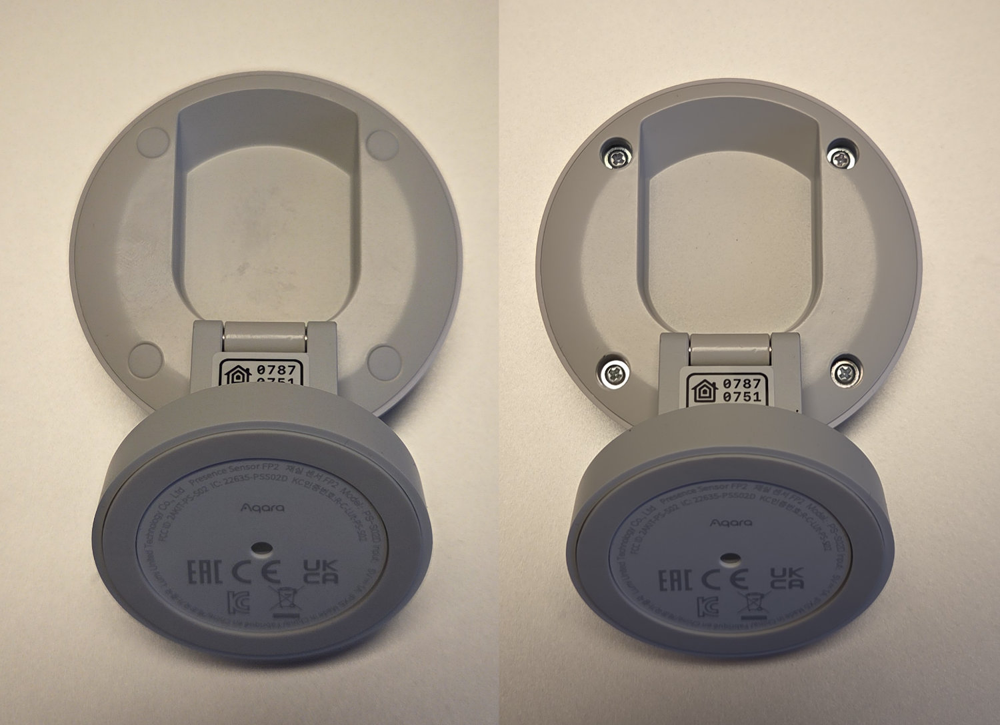
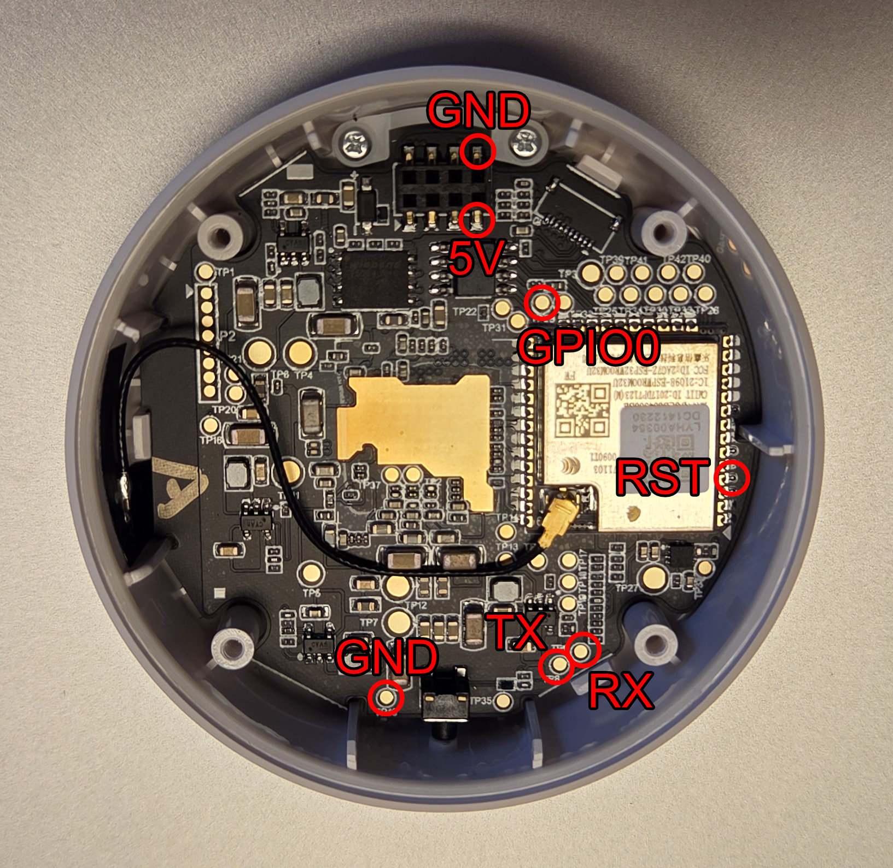
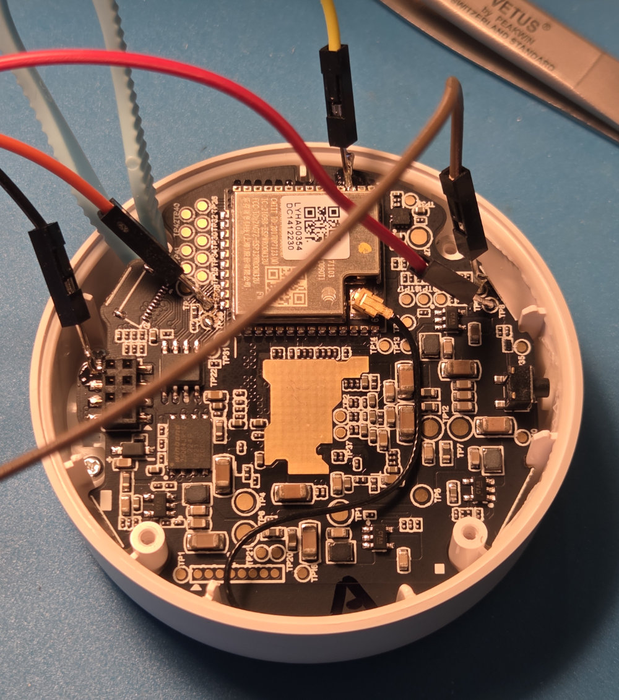

# Flashing ESPHome on the Aqara FP2

> **This guide replaces the stock Aqara firmware with ESPHome.** After the initial
> serial flash, all subsequent updates happen over Wi-Fi. You'll need physical
> access to the device **once** — to solder test-point connections for serial.

See the official ESPHome flashing guide for general tooling:
<https://esphome.io/guides/physical_device_connection/>

The canonical layout is **16 MB with a 4 MB `mcu_ota` partition** at offset
`0x433000` (matching stock Aqara exactly). This unlocks radar firmware OTA so
you can swap between FW1 (zone detection), FW2 (fall detection), and FW3
(sleep / vital signs) without ever touching the device physically again.

---

## 1. Back up stock firmware

**Do this before flashing anything else.** The stock flash contains per-unit
calibration data (accelerometer, OPT3001 light sensor, radar) **and the three
radar firmware images** — none of it can be recovered if lost.

```bash
pip install esptool
esptool --chip esp32 --port /dev/ttyUSB0 \
    read_flash 0x0 0x1000000 aqara_fp2_<serial>.bin
```

Note: rename the output file with the unit's serial number (from the QR code
on the device) — calibration is per-unit.

### Extract the radar firmware from your backup

The stock flash contains an `mcu_ota` data partition (4 MB at `0x433000`) that
holds the three TI IWR6843 MSTR container images needed for radar OTA. A
Python script is included to pull this out:

```bash
python scripts/extract_radar_firmware.py aqara_fp2_<serial>.bin
# → writes radar_firmware.bin (~2.4 MB) next to the input
```

The script parses the partition table, locates `mcu_ota`, trims trailing
`0xFF` padding, and verifies all three MSTR headers (FW1/FW2/FW3). See
[scripts/README.md](scripts/README.md) for full details.

Keep the resulting `radar_firmware.bin` somewhere safe — you'll host it over
HTTP(S) and point your YAML's `radar_firmware_url` at it. See §6 below.

---

## 2. Disassemble the device

1. Remove the 4 rubber plugs on the rear and unscrew the 4 screws.
2. Firmly pull the front and rear of the device apart — the rear panel
   unplugs from the USB daughterboard.





## 3. Connect to test points

You need: GND, 3V3 (or USB 5V via the daughterboard), TX, RX, EN (reset),
GPIO0 (boot mode).



- Prop the PCB up with a toothpick if you don't want to remove it fully from
  the case.
- If you do remove it, unplug the antenna first.
- Powering from the USB daughterboard is easier than soldering a 3V3 wire.

## 4. Place the partition table in the ESPHome config directory

Copy the canonical partition layout from this repo into your ESPHome config:

```bash
cp components/aqara_fp2/partitions_fp2.csv /config/esphome/
```

Or create `/config/esphome/partitions_fp2.csv` by hand with the contents of
[`components/aqara_fp2/partitions_fp2.csv`](components/aqara_fp2/partitions_fp2.csv).

Your YAML's `esp32:` block must then include:

```yaml
esp32:
  board: esp32-solo1
  flash_size: 16MB                    # unlocks upper 12 MB
  partitions: partitions_fp2.csv      # custom layout with mcu_ota
  framework:
    type: esp-idf
    sdkconfig_options:
      CONFIG_FREERTOS_UNICORE: "y"
      CONFIG_ESP_SYSTEM_SINGLE_CORE_MODE: "y"
    advanced:
      ignore_efuse_mac_crc: true
      ignore_efuse_custom_mac: true
```

Layout (verified byte-for-byte against ESP-IDF's `gen_esp32part.py`):

| Partition | Offset      | Size     |
|-----------|-------------|----------|
| otadata   | `0x009000`  | 8 KB     |
| phy_init  | `0x00B000`  | 4 KB     |
| app0      | `0x010000`  | 1792 KB  |
| app1      | `0x1D0000`  | 1792 KB  |
| nvs       | `0x390000`  | 436 KB   |
| **mcu_ota** | **`0x433000`** | **4 MB** |

---

## 5. Compile and flash

1. In the ESPHome addon, **Install → Manual download** to build
   `firmware.factory.bin`. It lands at
   `.esphome/build/<name>/.pioenvs/<name>/firmware.factory.bin`.
   Copy this file to wherever your `esptool` will run.

2. Put the ESP32 into download mode:
   - Easiest: a USB-serial adapter (CP2102, FT232) with RTS→EN and DTR→GPIO0
     auto-resets. esptool handles it automatically.
   - Otherwise: hold GPIO0 to GND and tap EN to reset.

3. Flash the factory image (bootloader + partition table + otadata + app,
   all in one):

```bash
esptool --chip esp32 --port /dev/ttyUSB0 --baud 460800 \
    erase_flash

esptool --chip esp32 --port /dev/ttyUSB0 --baud 460800 \
    write_flash --flash_mode dio --flash_size 16MB \
    0x0 firmware.factory.bin
```

> `--flash_mode dio` is correct for the FP2 module. `--flash_size 16MB` tells
> the ROM to accept a 16 MB image. Both are required.

## 6. Reassemble + stage radar firmware

Desolder test-point wires, reconnect the USB daughterboard, put the PCB back
into the case (plastic clips), **reattach the antenna before the rear panel
goes on**, screw it shut.

Device boots, connects to Wi-Fi, shows up in Home Assistant. The `mcu_ota`
partition is now empty. To enable radar OTA, point your YAML at a HTTP(S)
URL that serves your extracted `radar_firmware.bin`:

```yaml
aqara_fp2:
  radar_firmware_url: https://example.com/radar_firmware.bin
  radar_fw_stage:
    name: "Stage Radar Firmware"
  radar_ota:
    name: "Trigger Radar OTA"
  radar_ota_probe:
    name: "Radar OTA Probe (safe test)"
```

Hosting options for `radar_firmware.bin`:
- Upload to `/config/www/` on Home Assistant → URL
  `http://<ha-ip>:8123/local/radar_firmware.bin`
- Host on a GitHub repo and reference the raw URL
- Any static web server reachable by the FP2

Once the URL is reachable, in Home Assistant:

1. Press **Radar OTA Probe** — safe test, no flash writes. Confirms the
   radar bootloader accepts the XMODEM-1K handshake. Takes ~3 seconds.
2. Press **Stage Radar Firmware** — downloads 2.4 MB over HTTPS and writes
   it to `mcu_ota`. Takes ~15–60 s depending on Wi-Fi.
3. Press **Trigger Radar OTA** — streams the staged firmware to the radar
   over UART XMODEM-1K. Takes ~3 minutes.

### What's in radar_firmware.bin

The shipped `backup/radar_firmware.bin` and the one you'd extract from your
own backup both contain all three TI IWR6843 MSTR container images, packed
contiguously and byte-identical to the stock Aqara `mcu_ota` partition:

| Image | Offset      | Size    | MSTR version | Role |
|-------|-------------|---------|--------------|------|
| FW1   | `0x000000`  | 768 KB  | v1, 55 files | Zone Detection (default) |
| FW2   | `0x0C0000`  | 896 KB  | v1, 55 files | Fall Detection (DSP scoring) |
| FW3   | `0x1A0000`  | 708 KB  | v3, 55 files | Sleep Monitoring (vital signs) |

Total: 2,424,849 bytes, SHA256
`964d1fc24a78b1dcb1b8c18e3b4167ef475bb4b7cb87c68485909407ba31d2c2`.

When radar OTA runs, **the full 2.4 MB container is streamed** — the radar's
SBL handles the multi-image format internally. This matches the stock Aqara
app's behavior exactly.

---

## Recovery from a bricked device

If the device becomes unresponsive (corrupted partition table, failed flash,
etc.), reflash the factory image over serial:

```bash
esptool --chip esp32 --port /dev/ttyUSB0 --baud 460800 erase_flash
esptool --chip esp32 --port /dev/ttyUSB0 --baud 460800 \
    write_flash --flash_mode dio --flash_size 16MB \
    0x0 firmware.factory.bin
```

If you need to revert to stock Aqara firmware entirely:

```bash
esptool --chip esp32 --port /dev/ttyUSB0 --baud 460800 \
    write_flash --flash_mode dio --flash_size 16MB \
    0x0 aqara_fp2_<serial>.bin
```
